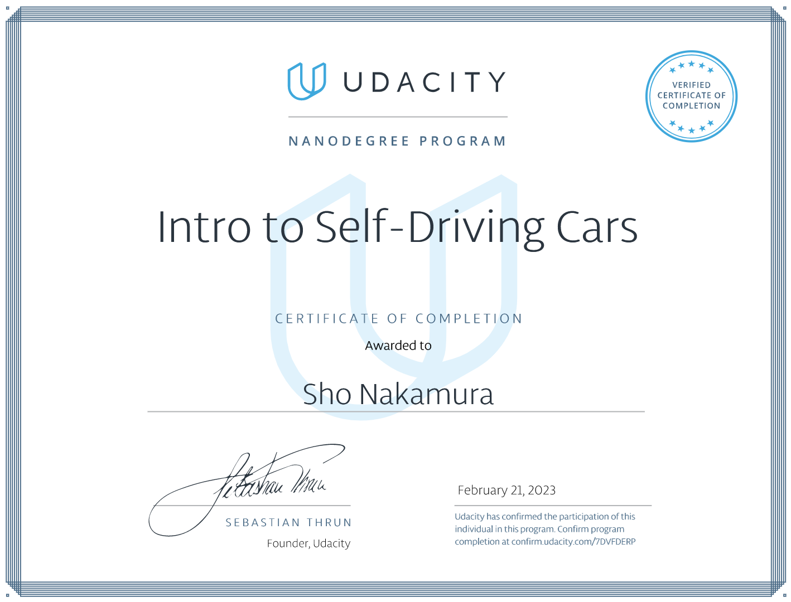

# Udacity-Intro-to-Self-Driving-Cars-Nanodegree

The Course contents are segregated into the following.

1. Orientation
2. Bayesian Thinking
3. Working With Matrices
4. C++ Basics
5. Performance Programming in C++
6. Navigating Data Structure
7. Vehicle Motion and Control
8. Computer Vision And Machine Learning

a
